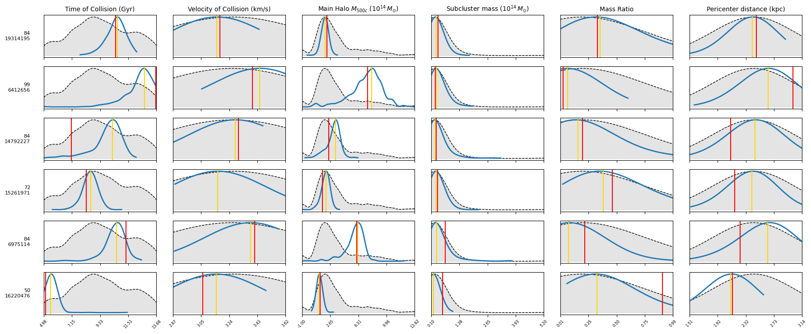
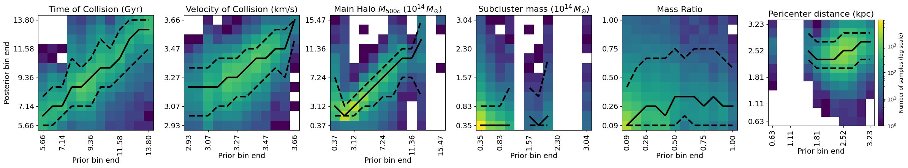
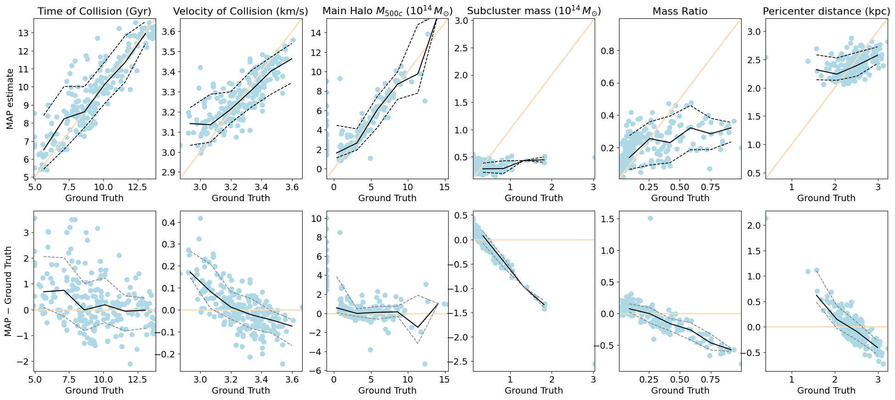
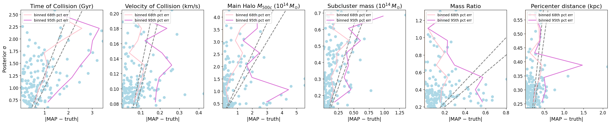
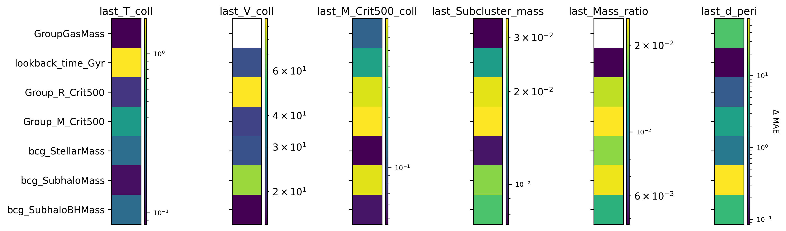
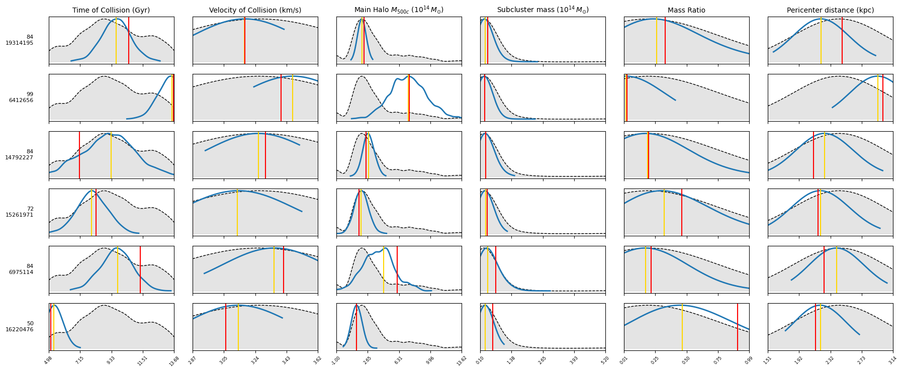
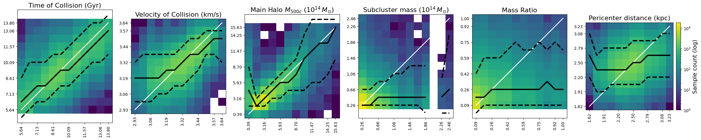
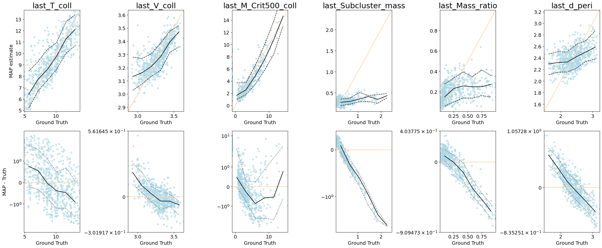

# Conditional Invertible Neural Networks for Galaxy‑Cluster Merger History

Welcome to **cINN‑Clusters**, a reproducible pipeline that predicts hidden merger properties of galaxy clusters from observable X‑ray quantities using a *Conditional Invertible Neural Network* (cINN).
The repository also includes a benchmark MLP ensemble, posterior‑diagnostic plots, and a feature‑sensitivity analysis.

### Brief Primer: GLOW Coupling Blocks & Conditional INNs

**GLOW-style affine coupling blocks**
GLOW (Kingma & Dhariwal 2018) is a flow-based generative model that builds an **invertible** mapping between data `y` and a latent variable `z ~ 𝒩(0,I)`.
A *coupling block* splits the input channels into two halves:

1. `y₁` (frozen pass-through)
2. `y₂` (transformed)

A shallow **sub-network** `s,t = f(y₁, x)` produces scale and shift vectors, and the transformation is

```
y₂′ = y₂ ⊙ exp(clamp · s) + t                 # forward
y₂  = (y₂′ − t) ⊙ exp(−clamp · s)            # inverse
log |det J| = Σ clamp · s                     # tractable Jacobian
```

Because half the channels pass through unchanged, the mapping is exactly invertible, fast in both directions, and its Jacobian determinant is cheap to compute—perfect for maximum-likelihood training.

A **random permutation** (or 1×1 convolution) is inserted between blocks so every dimension eventually influences every other.

---

**cINN – Conditional Invertible Neural Network**
A *conditional* INN learns a bijection **p(y | x)** by *conditioning* every coupling block on auxiliary inputs `x` (our observables / embeddings).
The forward pass converts targets `y` into latent `z`, and the inverse pass samples from the posterior `p(y | x)` by drawing `z` from a standard normal and running the network backward.

Key advantages:

* **Exact, analytic log-likelihood** → stable training.
* **Efficient sampling** → thousands of posterior draws per object in milliseconds.
* **Invertibility** → no information loss; uncertainty is naturally modelled.

---

### Dual-Input Design in This Repository

| Pipeline                          | Conditioning Vector **x**                                                                                             | Folder                         |
| --------------------------------- | --------------------------------------------------------------------------------------------------------------------- | ------------------------------ |
| **Scalar-only**                   | 7 physical observables (CSV `X.csv`)                                                                                  | `scalar/`                      |
| **Scalar + Representation Space** | • Same 7 observables **plus**<br>• A learned‐image embedding (≈ D\_emb ≈ 256–512) from the https://github.com/Shera1999/contrastive-learning respository which includes few self-supervised learning methods that are performed on X-ray maps of galaxy clusters.

*Both* pipelines predict the same 6 merger-history targets (`Y.csv`) and share identical cINN architecture and training logic; they differ only in **input dimensionality** and therefore have separate checkpoints (`best_cluster_cinn.pt`, `best_cluster_cinn_combined.pt`) and plotting notebooks.


---

## Directory Structure

```
CINN_GLOW/
├── scalar/
│   ├── data_filter.py              # Pre-processing from raw → scaled CSVs
│   ├── model.py                    # cINN architecture (FrEIA + PyTorch)
│   ├── train_cinn.py               # Training script for the flow model
│   ├── mlp_baseline.py             # MLP ensemble baseline
│   ├── processed_data/             # Generated by data_filter.py
│   │   ├── X.csv | Y.csv | meta.csv
│   │   ├── obs_scaler.pkl | tar_scaler.pkl
│   │   └── … (intermediate files)
│   ├── 1.posterior_distrubution.ipynb
│   ├── 2.prediction_performance1.ipynb
│   ├── 2.prediction_performance2.ipynb
│   ├── 3.uncertainities.ipynb
│   ├── 4.cross_correlations.ipynb
│   └── 5.sensitivity_analysis.ipynb
├── scalar+representation_space/  # pipeline using scalars + learned embeddings
│   ├── data_filter.py            # shared pre-processing
│   ├── model.py
│   ├── train_cinn_combined.py
│   ├── mlp_baseline.py
│   ├── processed_data/
│   ├── embeddings.npy
│   ├── filenames.npy
│   ├── best_cluster_cinn_combined.pt
│   ├── 1.posterior_distribution.ipynb
│   ├── 2.prediction_performance1.ipynb
│   ├── 2.prediction_performance2.pnipynbg
│   └── 3.sensitivity_analysis.ipynb
├── README.md

```

All code lives inside the \`\` sub‑directory; feel free to reorganise later (e.g., move plotting scripts into their own folder), but the README assumes the structure above for now.

---

##  Installation

```bash
# clone & enter
git clone https://github.com/Shera1999/CINN_GLOW.git
cd cinn_project

# create env & install deps
python -m venv venv
source venv/bin/activate
pip install -r requirements.txt
```

`requirements.txt` lists:

```
pandas numpy torch scikit‑learn joblib matplotlib FrEIA
```

CUDA is auto‑detected if available.

---

## Data Preparation

```bash
python data_filter.py \
   --obs_csv  path/to/observables1.csv \
   --unobs_csv path/to/unobservables1.csv \
   --out_dir  processed_data
```

*Creates* `processed_data/` with scaled feature/target matrices plus fitted `StandardScaler` pickles.
`data_filter.py` reproduces the exact train/val/test split used everywhere else by fixing `random_state` to **42**.

---

## Training the cINN

```bash
python train_cinn.py \
   --processed_dir processed_data \
   --epochs 250
```

*Outputs* `best_cluster_cinn.pt` (saved whenever validation NLL improves).

### Hyper‑parameters

* `hidden_dim=128`, `n_blocks=12`, `clamp=2.0` (Glow‑style affine coupling blocks)
* Optimiser: Adam, `lr=2 × 10⁻³`

---

##  Baseline MLP Ensemble & Sensitivity

```bash
python mlp_baseline.py --processed_dir processed_data
```

1. Trains **7** independent MLPs (phase‑1 MSE → phase‑2 MAE).
2. Writes median test predictions to `mlp_test_pred.npy` and ground truth to `mlp_test_true.npy`.
3. Produces `sensitivity_matrix.csv` used in Fig. 5.

---

## Generating Figures

All plotting scripts assume:

* `best_cluster_cinn.pt` exists in project root.
* `processed_data/` contains the pre‑processed CSVs & scalers.

Run any script inside the jupyter notebook files:

```bash
1.posterior_distribution.ipynb       # Fig. 1  prior v posterior grid
2.prediction_performance.ipynb       # Fig. 2a heat‑maps, Fig. 2b truth v MAP
3.uncertainities.ipynb               # Fig. 3  calibration
4.cross_correlation.ipynb            # Fig. 4  pairwise correlations
5.sensitivity_analysis.ipynb         # Fig. 5  feature sensitivity
```

Each script saves a high‑resolution PNG (and commented‑out PDF) in the repo root with intuitive file names:

```
posterior_distribution.png
2.prediction_performance1.png
2.prediction_performance2.png
3.uncertainities.png
4.cross_correlations.png
5.sensitivity_analysis.png
```

---

##  Figure Gallery

=======
| #  | File                           | Insight                                                                        
| -- | ------------------------------ | ------------------------------------------------------------------------------ 
| 1  | 1.posterior\_distribution.png    | Side‑by‑side prior/posterior comparison with MAP + truth per cluster.          
| 2a | 2.prediction\_performance1.png | Heat‑maps of how posteriors shift relative to prior bins across targets.       
| 2b | 2.prediction\_performance2.png | MAP accuracy & error distribution as a function of ground‑truth value.         
| 3  | 3.uncertainities.png           | Checks correlation between predicted σ and actual                              
| 4  | 4.cross\_correlations.png      | Joint distributions (truth, posterior, MAP) for every target pair.             
| 5  | 5.sensitivity\_analysis.png    | Which observables most influence MAE for each target (ensemble ablation test). 

### 1  Prior vs Posterior (Figure 1)


*Side‑by‑side KDE curves of the population prior (grey dashed), model posterior (blue), MAP estimate (gold), and ground truth (red) for every cluster and target.*

---

### 2a  Posterior Heat‑maps (Figure 2a)


*2‑D heat‑maps of prior bin → posterior bin counts, overlaid with median (solid) and 10th/90th percentile (dashed) lines for each target.*

---

### 2b  MAP & Error Trends (Figure 2b)


*Top row: Ground‑truth vs MAP predictions.  Bottom row: Absolute error vs truth (symlog scale) with 16th/84th percentile bands.*

---

### 3  Uncertainty Calibration (Figure 3)


*Scatter of |MAP − truth| versus posterior σ, including Gaussian reference curves and binned 68th/95th percentile error lines.*

---

### 4  Cross‑correlations (Figure 4)


*Staircase grid of pairwise scatter plots showing joint distributions of truth (red), posterior samples (light‑blue), and MAP predictions (mustard) for every target pair.*

---

### 5  Feature Sensitivity (Figure 5)


*Log‑scaled Δ MAE heat‑map indicating how omitting each observable affects prediction error for each target.*

---

### Scalars + Representation‑Space Pipeline

Figures below show results when **learned embeddings** (representation space) which is a result from https://github.com/Shera1999/contrastive-learning, are concatenated with scalar observables as the cINN condition.

#### 1  Prior vs Posterior (Combined)


*Posterior vs prior KDEs when the model is conditioned on both scalar features and learned image embeddings.*

---

#### 2a  Posterior Heat‑maps (Combined)


*Heat‑maps showing how posterior samples distribute across prior bins for the combined‑input model.*

---

#### 2b  MAP & Error Trends (Combined)


*Truth vs MAP and error trends for the combined‑input model.*

---

#### 3  Feature Sensitivity (Combined)


*Δ MAE heat‑map after ablation in the combined‑input MLP ensemble.*

---